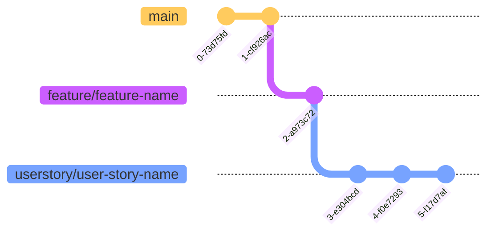
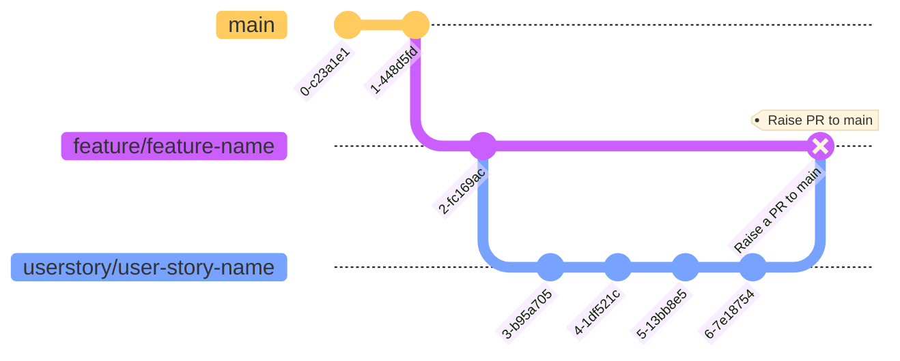
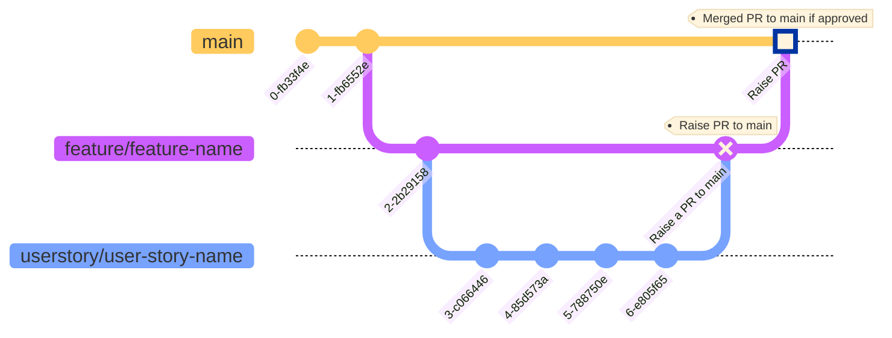

# Instructions for Sr. Software Engineer Candidates
## Selecting a Homework Theme
Select 1 project theme from the list below based on your skillsets (front-end, back-end/data retrieval from a database management system, full-stack).
 
> The deadline may be tight or simply a breeze for some. Guidelines may not be complete, or hanging, and some areas need questioning. This is an opportunity for you to bring out your creativity, design choices, decisions, and approaches within the time (constraint) you are given. You may discuss further and ask questions during the follow-up interview/s. Just make sure you have something – create and merge branches, commit and push changes, add a markdown document, add diagrams, and raise a PR.
 
1. **Front-End Skills (JavaScript/TypeScript/etc.)**
    - **Suggested Project: Personal Portfolio Website**
        - Description: Create a responsive portfolio website using any technology stack and framework you are comfortable using. On this site, showcase your skills, projects, and achievements.
        - Key Aspects: Design and front-end development skills (HTML, CSS, JavaScript/TypeScript, etc.), frameworks and platforms.
            - >_Note: Content can be database-driven or not. It's up to you._
        - Duration: 3-5 days (We will review whatever you can complete in this timeframe).
2. **Data Retrieval Skills (Database Management)**
    - **Suggested Project: Library Management System**
        - Description: Design and implement a library management system. This involves creating a database schema and handling book cataloging, user registration, and transactions. A web app as a front-end or presentation layer is not needed for this task but you may add it if you would like to do so.
        - Key Aspects: Database design, SQL queries, and data retrieval.
            - Local DB environment or Serverless: Deploying on a local DB environment or to serverless platforms (e.g., AWS Lambda, Azure Functions).
            - >_Note: Schema, scripts to create sample tables and populate sample test data, SQL queries, Views, optimizations, and Stored Procedures would suffice if your skillset is focused on DB management, data engineering, or data retrieval in general. You may add diagrams, and screenshots and put them in a readme file._
        - Duration: 3-5 days (We will review whatever you can complete in this timeframe). 
3. **Full-Stack Mini Web Application**
    - **Suggested Project: Basic/Simple Online Chat Application**
        - Description: Build a real-time chat application using WebSocket, Node.js, React, etc. Users can send messages, join rooms (if you can add this feature), and view chat history.
        - Key Aspects:
            - Front-End: UI development, real-time communication.
            - Back-End: Handling messages, APIs, user authentication, etc.
            - Local DB environment or Serverless: Deploying on a local DB environment or to serverless platforms (e.g., AWS Lambda, Azure Functions).
        - Duration: 3-5 days  (We will review whatever you can complete in this timeframe).
4. **Open Category**
    - **Project: Any project you want to design, code, and share**
        - >_You are given the liberty to showcase your skillsets, frameworks, platforms, and tools you used._
        - Duration: 3-5 days (We will review whatever you can complete in this timeframe).
---
## Instructions
 
1. **Private Repository Access**
   > If you are able to read this `readme` then the following items are already done.
   >- ~~Send your personal GitHub username to the Talent Acquisition staff assigned to you.~~
   >- ~~Hiring Managers will send you an invitation to be a collaborator to a private repository.~~
   >- ~~Check your inbox for a private repository access invite.~~
   >- ~~Log in to GitHub.com using your account and accept the invite.~~
2. **Branch Setup**
   - Imagine a situation in which you are part of an agile development team and the features and user stories were already defined by the Product Owner and groomed with the help of your Scrum Master and now you need to execute the development of features in Sprints. Use your previous experience to conceptualize or come up with features and user stories based on the project theme you've chosen.
   - The 2 branches that should at least be in the private repo are (a) feature and (b) userstory.  Create these 2 branches from the private repository created for you by the Hiring Manager/s, as you progress in your development:
      - **`feature/<feature-name>`**: This branch will contain the high-level features that you will come up with.
      - **`userstory/<user-story-name>`**: This branch will contain the implementation of your conceptualized user story which then can be merged into the feature branch.
3. **Feature/User Story**
   - Conceptualize features and user stories related to your selected project/homework theme (e.g., user authentication, data retrieval, API integration, etc.).
   - You may add a document of the conceptualized feature or user story in a single or separate file (e.g., `feature.md` or `userstory.md`) that you can push to the repo. It is desirable that you include a brief description, acceptance criteria, and any relevant details. You decide whether to write only one main document with sections, or separate markdown files.
4. **Implementation**
   - Implement the feature or user story in your local development environment.
   - Commit, push, and merge your changes to the appropriate remote branches (`feature/<feature-name>` or `userstory/<user-story-name>`).
 

5. **Pull Request (PR)**
   - Create a pull request (PR) of the feature/s with the merged user story branches to the main branch.
   - In the PR description, explain your approach, any challenges faced, and any trade-offs made.
   - The Hiring Tech Manager/s or a Sr. SWE representative will review the PR and provide feedback.
 

6. **Approval and Merging**
   - Within the timeframe of the hiring process, the Hiring Tech Manager/s or a Sr. SWE representative may approve the PR if it meets the requirements and adheres to best practices.
   - Then the Hiring Tech Manager/s or a Sr. SWE representative may merge the approved PR into the main branch.
    

